# Speculate

> Built with heavy use of AI coding agents. Everything here is reviewed and tested, and the test suite runs on Linux, macOS, and Windows, but weigh that as you would any other statement about how software was made.

Speculative prefetching for coding agents. Speculate sits between your MCP client (Claude Code, Cursor, any host) and its MCP servers, predicts the next read-only call, runs it early, and serves the result the moment it's asked for. Like Gmail preloading your inbox, applied to tool calls.



The same workflow twice, against a mock server with injected latency. Reproduce with `npm run demo`.

## Install

```bash
npm install -g speculate-mcp
speculate on
```

That is the whole setup. `speculate on` re-registers this project's MCP servers wrapped, using Claude Code's own `claude mcp` CLI rather than editing any file by hand, and installs a small hook so servers you add later get wrapped too, starting from your next session.

Nothing else to configure. Speculate recognizes servers by their live tool lists, ships predictions for GitHub, filesystem, and Slack, and learns the rest from your own traffic.

Using a different MCP client? See [Any other MCP client](#any-other-mcp-client).

## Commands

| Command | What it does |
|---|---|
| `speculate on` | Wrap this project's MCP servers, and keep new ones wrapped |
| `speculate off` | Restore this project exactly, and stop auto-wrapping it |
| `speculate status` | What is wrapped here, and what changed since `on` |
| `speculate stats` | Cumulative time saved, hit rate, and waste (`--json` for scripts) |
| `speculate try` | Launch a throwaway session to try it, writing nothing |

<details>
<summary>How auto-wrapping behaves</summary>

`on` installs a hook-only plugin at Claude Code's user scope, shared by every project. At each session start it wraps any newly added, already-approved servers.

- **One session behind.** Claude Code reads MCP config before session-start hooks run, so a server you add now is wrapped from your *next* session, not this one. It works normally in the meantime, just without prefetching.
- **Approval is never widened.** A server still pending approval in `.mcp.json` stays pending. Revoke an approval, or delete the server, and the wrapped copy is removed at the next session start.
- **`--resume` and `--continue` do not trigger it.** The hook runs on fresh sessions only; `speculate on` always wraps on the spot.
- **Removing it everywhere:** `off` covers one project. To stop it globally, `claude plugin uninstall -s user speculate-autowrap`, then `claude plugin marketplace remove speculate-mcp`.

</details>

## Any other MCP client

No install and no Claude Code required: prefix the server command already in your client's config:

```jsonc
// before
"github": { "command": "github-mcp-server", "args": ["stdio"] }

// after
"github": {
  "command": "npx",
  "args": ["-y", "speculate-mcp", "wrap", "--", "github-mcp-server", "stdio"]
}
```

The client sees standard MCP: same tools, same results, except predicted reads come back from a local buffer instead of a network round trip. Ask the agent to call `speculate__stats` for the current MCP session's live hit rate, time saved, and **how stale the served prefetches were** — `ageAtHit` reports the median and p95 age of what was handed over, and the share consumed in the last quarter of their TTL, so you can see whether hits are fresh or scraping the edge. `speculate stats` reports durable cumulative usage.

## Safety

- Speculation only ever executes tools that are affirmatively read-only (`readOnlyHint` + allowlists in `strict` mode; annotations alone in `annotated`, the zero-config default). Unknown tools are never speculated; real calls, including writes, are forwarded verbatim, and any mutation flushes the cache.
- Cached results are byte-identical, single-use, short-TTL, and never written to disk. Persisted learning contains tool names and argument templates, never results.
- `speculate on` mutates config only through the host's own CLIs (`claude mcp`, `claude plugin`), records what it did, and `off` restores exactly.

## More control

A config file (JSON with comments) adds per-server modes, allow/denylists, TTLs, budgets, and declarative prediction rules. See [`speculate.config.example.json`](speculate.config.example.json). `speculate init` writes a starter; `speculate doctor` explains per-tool eligibility ("why isn't it speculating?").

`speculate shims install` is the equivalent of auto-wrapping for clients other than Claude Code: opt-in `npx`/`uvx` shims that wrap any MCP server any client launches. It edits one marked block in your shell rc file, and it is POSIX-only.

Architecture, measured results, threat model, and design history: [DESIGN.md](DESIGN.md).

## Development

```bash
npm install     # builds dist/ via the prepare hook
npm test        # unit and end-to-end suite
npm run bench   # speculation off vs on
npm run demo    # the README demo, against the bundled mock
```

Running the test suite needs Node >= 20.19 (vitest's native rolldown binding; npm silently skips it on older Node). The runtime floor for *using* speculate is unchanged at Node >= 18.

Layout: `src/proxy.ts` (router), `src/executor.ts` (speculation + drain queue), `src/predictor.ts`/`learner.ts`/`priming.ts` (prediction), `src/cache.ts`, `src/policy.ts`/`budget.ts` (safety and limits), `src/manage.ts`/`tryRun.ts` (on/off/try), `mock/`, `bench/`.

## Non-goals

Speculating writes (permanent), owning upstream auth, general response caching, token savings. The win is wall-clock latency.

## License

MIT
