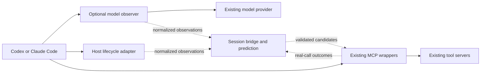

# Context-Aware Speculation for Codex and Claude Code

## Execution addendum: current-main reconciliation

Implementation starts from `d2445a5` (`origin/main`, v0.22.0), not the v0.10 checkout inspected during planning. This addendum overrides obsolete implementation references below:

- Both clients already have native/global `on`, `off`, `sync`, policy, and hook support. Reuse `codexClient.ts`, `codexPolicy.ts`, `codexHooks.ts`, `codexManage.ts`, `hostConfig.ts`, and `manage.ts`; preserve those current behaviors.
- `tryRun.ts`, bundled workspace/shell tools, the exec daemon, and built-in profiles were intentionally retired. Do not restore them. The new optional session launcher uses current native configuration APIs; Task 8 verifies registered filesystem/git MCP tools on both hosts. Native shell calls may supply observations but are not intercepted or prefetched by this change.
- Intent candidates must resolve through live tool schemas and explicit, unambiguous mappings. A historical built-in GitHub/filesystem profile is not available or implied.
- Existing adaptive admission, privacy filtering, single-use cache lifecycle, and measurement accounting remain authoritative. Observer candidates use the same scoring/admission and executor path.
- Existing `npm run bench` runs the repeated-workflow benchmark; `npm run bench:mock` is the old synthetic GitHub benchmark. Use current scripts, existing fixtures, and real Codex tests.
- The user's current instruction authorizes implementation and a normal fast-forward push of the completed branch to `main`, not a release/default enablement. Keep new model observation opt-in/experimental until real-client authentication and incremental performance gates are demonstrated. Report unverified live paths explicitly; do not substitute fixture success for live verification.
- A separate isolated branch is used so remote work is preserved. No merge, rebase, force-push, or publish is included.


Status: proposed design for review; implementation has not started.

## Goal

Reduce agent task time by giving Speculate earlier task context and visibility across tools, while retaining its existing read-only execution, budgets, cache fidelity, and host permission boundaries. Codex and Claude Code are first-class peers in the initial release, including setup, authentication, transport, diagnostics, recovery, benchmarks, and documentation.

Headroom demonstrates a useful integration pattern. Its adoption and performance do not establish that an LLM proxy will improve Speculate: this design requires measurements against Speculate's existing prefetcher.

## Existing behavior and integration seams

- `src/proxy.ts:696` schedules prediction after successful real tool results, off the return path. Speculate already uses the following model turn as a prefetch window.
- `src/learner.ts:124` maintains separate previous-call chains per server. `src/predictor.ts:337` binds candidates to the triggering server.
- `src/wrap.ts:162` names independently wrapped MCP upstreams `upstream`; `src/hostConfig.ts:202` currently discards the host alias when wrapping. Tool name alone cannot identify the destination process.
- `src/proxy.ts:355` owns collision-resolved exposed routes. Registration must use these routes, including tool-list changes.
- `src/executor.ts:113` checks eligibility, TTL, cache deduplication, and budgets. Its optional `Prediction.key` is trusted internally, so an external candidate must never supply it.
- `src/tryRun.ts` currently supports Claude Code only. New host support must not require unrelated rewrites of `manage.ts` or existing commands.
- `src/execDaemon.ts` owns the workspace command cache. Its current `exec` operation represents a real call, not a prefetch ingress. Native command consumption presently depends on the Claude Bash hook.
- `src/metrics.ts` already attributes hits and waste to rules. `estimatedSavedMs` is avoided tool wait, not measured end-to-end task acceleration.

## Approaches considered

| Approach | Benefit | Cost | Decision |
| --- | --- | --- | --- |
| Host hooks and a session bridge | Earlier user intent and cross-tool observations without changing model traffic | Host-specific lifecycle adapters; no streamed model visibility | Implement as the baseline on both clients |
| Optional transparent LLM observer using the same bridge | Access to request context and completed streamed tool calls | Authentication, protocol, streaming, and recovery compatibility | Implement for both clients; enable according to measured benefit |
| Move tool execution into a new LLM gateway | One apparent integration point | Duplicates tool runtimes, cache ownership, auth, and permissions | Excluded |

No prompt compression, model/effort routing, proxy-owned tool loop, additional prediction LLM, shared semantic memory, or provider credential acquisition is included.

## User experience

Add symmetrical launch commands, leaving existing command meanings intact:

```sh
speculate run claude --observe hooks -- <client arguments>
speculate run codex --observe hooks -- <client arguments>
speculate run claude --observe proxy -- <client arguments>
speculate run codex --observe proxy -- <client arguments>
speculate run claude --observe off -- <client arguments>
speculate run codex --observe off -- <client arguments>
```

`hooks` supplies context and real-call events; `proxy` includes hooks plus the model observer; `off` runs the same wrapped tool setup with existing prediction only. The default for the new command is `hooks`. The LLM proxy remains explicit until its performance gate passes. Mode names describe signal sources, not permission settings.

Use temporary launch configuration or supported per-invocation overrides. Preserve the selected model, reasoning/effort controls, account, endpoint, upstream headers, approval policy, sandbox, and tool consent. Do not add broad allow rules or change global host settings. Existing `try`, `on`, `off`, `status`, `update`, and manual `wrap` semantics remain compatible.

At startup report client, observer mode, transport, number of registered tool routes, and concrete unsupported capabilities. At exit show per-signal hits, joins, waste, and estimated tool wait avoided. `--json-report <path>` on `run` optionally writes that same content plus transport measurements; it never includes raw prompts, credentials, arguments, or results. Existing durable stats remain valid and are not double-counted.

## Architecture



### Session bridge and tool ownership

One bridge belongs to one `speculate run` launch. Use an owner-only temporary directory, a private local IPC endpoint, and a random per-launch capability. Child wrappers receive these coordinates and their original host MCP alias through ephemeral launch configuration. Neither coordinates nor capabilities go upstream.

Wrappers register their instance ID, generation, host alias, actual exposed routes, underlying tool identities, current input schemas, and execution context. The bridge allocates opaque route IDs. A provider adapter maps observed model-facing tool names to a single registered route using verified host naming rules and actual advertised schemas. Never infer identity solely by splitting an arbitrary tool name. Unknown, ambiguous, deferred-but-unresolved, remote-unwrapped, or disconnected tools are observed but not prefetched.

Each prediction returns to the process that owns the eventual cache lookup. The bridge must not launch a second upstream connection or fetch results itself. Reconnection, schema changes, mutations, and session termination invalidate registrations or generations as appropriate. Track subagent/conversation IDs separately within a launch; ambiguous correlation disables that observation rather than mixing histories.

### Candidate ingress

Use a narrow runtime-validated envelope: protocol version, launch/conversation ID, candidate ID, destination route ID, route generation, source event ID, source kind, complete argument object, confidence, and bridge-stamped creation time. Confidence and rule IDs are internally assigned, not accepted as execution authorization.

Limits: 3 candidates per event, 64 KiB per candidate envelope, 1 second maximum candidate age, 256 pending observation events, and 500 learned transitions per conversation. Bound replay IDs to 4,096 entries with a 120-second lifetime. Queue overflow discards observation work without blocking model or tool traffic. Route registration may use multiple bounded messages for large tool catalogs.

At the receiving wrapper, resolve the live route, validate arguments against its current `inputSchema` with the installed MCP SDK JSON Schema validator, verify session and generation, drop replayed/expired entries, and recompute the canonical key locally. Require adapter-verified host preauthorization for the exact tool/argument combination in the current permission context; permission to start its MCP server and a read-only annotation are insufficient. An approval-required, denied, or unverifiable call produces no prefetch. This check grants no permissions and is reevaluated when host policy/context changes. Unsupported schemas disable speculation for that route. Reuse the existing confidence/waste feedback policy before `executor.submit`, then the existing eligibility, TTL, concurrency, rate, timeout, and cache checks. No imported key, executable, environment override, arbitrary server address, or caller-selected rule ID is accepted.

Pending and in-flight work must respect locally observed invalidation: once an owning wrapper observes a mutation, a prediction from its prior generation cannot become a valid cached result. Use generation checks before queued issue and cache publication, and discard affected queued candidates on invalidation. Deliver mutation/control events separately from the droppable prediction queue. Hooks report unknown/mutating native tools at start and settle, but delivery can still fail; native and external changes therefore retain the existing TTL/watcher freshness limits rather than an absolute no-stale-read guarantee. On detected event loss or bridge disconnect, invalidate session-derived candidates and suspend affected prediction until routes are reestablished. Tests must cover dropped hooks and report reduced freshness coverage, including the possibility of an undetected gap; do not claim every external mutation is observed.

### Prediction sources

1. **Cross-server transitions.** A session-local adapter reuses `TransitionLearner` with opaque route IDs as qualified tool identities under one conversation scope. It maps output back to live destination routes. Observe only completed real calls, never speculative executions. Exclude unordered concurrent completions from adjacency learning; use host call order and suppress ambiguous overlaps. Existing per-server learners continue to work. New cross-server state stays in memory, avoiding a persistence migration.
2. **Explicit user intent.** Both prompt hooks and model-request adapters supply the current user turn. Start with strict patterns for an explicitly referenced GitHub PR URL and an explicitly requested workspace directory listing. Resolve exact arguments through live registered tool schemas/profile mappings; missing repository identity, unknown directory, negation, quoted examples, or ambiguous intent produce no candidate. Do not speculate on arbitrary URLs or invent tools. No additional model call is made.
3. **Completed streamed tool calls.** Accumulate arguments per provider call/item ID. Emit a candidate only at the protocol's completed-arguments boundary with the full tool identity, valid arguments, and an executable registered route. A parsable JSON prefix is insufficient. Free-form code, code-mode programs, provider-hosted tools, and opaque/encrypted reasoning are passed through without execution or inference about hidden contents.

The same strategy may observe one event through hooks and the proxy. Deduplicate by host call/request identity plus route generation and canonical arguments; do not suppress a later distinct real call merely because it has equal arguments. Separate rule IDs (`observer:<client>:intent`, `observer:<client>:stream`, `observer:<client>:transition`) support attribution and feedback.

### Model observation and transport preservation

Parse a bounded copy of traffic while forwarding original payload bytes and end-to-end headers. Do not reserialize model requests, append instructions, modify tool lists, rewrite history, alter model/effort settings, or buffer an entire response before forwarding it. Preserve prompt-cache prefixes and unknown provider fields. Normalize only the observation side channel.

Observe at most 2 MiB per request, 64 KiB per assembled candidate, and 8 MiB of rolling conversation context per conversation, with a 32 MiB session cap. Oversized or undecodable data disables analysis of the affected request, not forwarding. Apply backpressure to the transport independently of the bounded observation queue. Observer callback failures cannot break forwarding.

Codex incremental requests may contain only new input and `previous_response_id`. Maintain bounded per-conversation observation state without changing provider state. Preserve WebSocket connections, frame order, cancellation, continuation IDs, multiplexed stream IDs when present, and connection-local state. Never disable WebSockets silently to simplify implementation. Unknown protocol variants remain transparent and report reduced observation coverage.

The proxy binds loopback and forwards only to the endpoint selected at launch. Reject arbitrary-target/CONNECT use and do not forward credentials through redirects to a different origin. Keep provider authentication distinct from local bridge authentication. A live observer worker failure can degrade to transparent forwarding; a relay process crash can interrupt a live request. Report this honestly, restart under the launcher, invalidate stale candidates, and let the client retry; never replay a partially forwarded model request automatically.

## First-class compatibility matrix

| Requirement | Claude Code | Codex |
| --- | --- | --- |
| Launch and temporary overrides | Dedicated Claude adapter | Dedicated Codex adapter |
| Native account | Existing Claude login/subscription | Existing ChatGPT login/subscription |
| API credentials | Existing API-key/gateway configuration | Existing API-key/custom-provider configuration |
| Model traffic | Messages JSON and SSE; required auxiliary endpoints | Responses JSON/SSE and WebSocket; required auxiliary endpoints |
| Native controls | Preserve model picker, beta/version headers, tools and permissions | Preserve model, effort, auth/account headers, continuation and sandbox controls |
| Context hooks | Prompt, tool lifecycle, session lifecycle | Prompt, tool lifecycle, session lifecycle |
| Tool execution | Registered MCP tools and workspace MCP | Registered MCP tools and workspace MCP |
| Verification | Same correctness and performance suite | Same correctness and performance suite |

Record exact client versions and tested auth/transport combinations in a compatibility artifact. Subscription forwarding is a required feasibility test, not an assumed consequence of API-key forwarding. Inspect supported host configuration and request metadata; do not extract tokens from browser storage or build new login/refresh flows. If either required auth path cannot be preserved, the complete proxy release is blocked and the unresolved path is reported explicitly. Hook mode remains useful on both clients.

Both clients' hooks can observe native shell calls. Native shell cache consumption needs its own paired proof: exact cwd/environment/sandbox equivalence, actual dispatch through `speculate exec`, unchanged output, and unchanged authorization. Codex's documented input rewriting currently requires an `allow` decision; do not use that to bypass a permission prompt. New native-shell acceleration ships for both only if these conditions are established. Otherwise both use the shared workspace MCP path; native calls still inform prediction, and no unused prefetch is reported as a native speedup. Existing Claude hook behavior is outside this change.

## Measurement and release gates

Compare separately for each client: A = no Speculate, B = current tool speculation, C = B plus hook context/cross-server learning, D = C plus request observation, E = D plus stream candidates. B is the main baseline for incremental gains. Match models, effort, prompts, fixture state, tool latency, and warm/cold conditions; randomize run order and isolate learning per run.

Use at least 20 held-out workflows per client, covering PR review, issue-to-code navigation, local exploration, cold starts, repeated workflows, mixed tools, unpredictable requests, failures, mutations, and parallel/subagent calls. Run 5 repetitions per workflow and arm in deterministic replay. Train transition examples separately from held-out cases. Live smoke tests cover both clients and required auth paths; representative live task runs verify that replay gains transfer, with observed API usage/cost reported.

Report task wall time, tool wait, time to first response byte, p50/p95 latency, candidate-to-dispatch head start, useful hits/joins, wasted/extra tool calls, contention, task correctness, token usage when provided, observation coverage, and failures. Per-hit estimated time saved must never be substituted for end-to-end improvement. Shadow observations may estimate coverage/precision; they cannot establish realized latency savings.

Proposed acceptance thresholds, fixed before running the experiment:

- Zero unexpected writes, consent bypasses, wrong-session results, or altered model/tool payloads in deterministic correctness tests.
- Zero additional LLM calls from the predictor; actual tool and model usage is reported.
- At most 5 ms p95 added local forwarding latency in the loopback transport benchmark.
- At least 10% median task-time improvement versus B on the held-out tool-heavy set for each client, with a bootstrap 95% interval excluding zero improvement.
- No greater than 5% p95 task-time regression on the mixed/low-predictability set for either client; report per-workflow regressions too.
- Wasted speculative executions at most 20% of issued speculative executions after TTL expiry/cleanup, with issued, consumed, invalidated, and pending counts distinguished.
- Proxy mode becomes a default only if its own incremental D/E versus C comparison shows an improvement for both clients under the same correctness/regression gates. Otherwise retain it as explicit experimental functionality, or remove the unsuccessful signal before release.

These are targets, not existing results. If they fail, retain independently useful stages and report the failed gate; do not adjust thresholds after seeing the data or publish a combined result that hides one client's regression.

## Sources and verification boundaries

Checked 2026-09-14. Re-check moving provider/client interfaces when implementing; record the resolved versions and Headroom commit used for fixtures.

- [Headroom proxy](https://github.com/headroomlabs-ai/headroom/blob/main/headroom/proxy/server.py), [wrapper](https://github.com/headroomlabs-ai/headroom/blob/main/headroom/cli/wrap.py), and [response handler](https://github.com/headroomlabs-ai/headroom/blob/main/headroom/ccr/response_handler.py): model-side observation, host integration, and the boundary between proxy-owned and client-owned tools.
- [Headroom Codex runtime](https://github.com/headroomlabs-ai/headroom/blob/main/headroom/providers/codex/runtime.py): API and ChatGPT routing require distinct treatment; this source is a reference, not a supported-provider guarantee.
- [Codex configuration](https://learn.chatgpt.com/docs/config-file/config-reference): custom provider base URL/auth controls, Responses wire API, and WebSocket capability. Built-in provider IDs are reserved; do not assume they can be replaced by a custom provider table.
- [OpenAI WebSocket mode](https://developers.openai.com/api/docs/guides/websocket-mode): stateful continuation and stream identity must survive forwarding.
- [Codex hooks](https://learn.chatgpt.com/docs/hooks): prompt/tool lifecycle events and current input-rewrite requirements.
- [Claude gateway requirements](https://code.claude.com/docs/en/llm-gateway) and [Claude hooks](https://code.claude.com/docs/en/hooks): endpoint/header compatibility and lifecycle integration.

This planning pass inspected source and documentation. It did not exercise live client subscriptions, implement adapters, or establish performance improvements.
